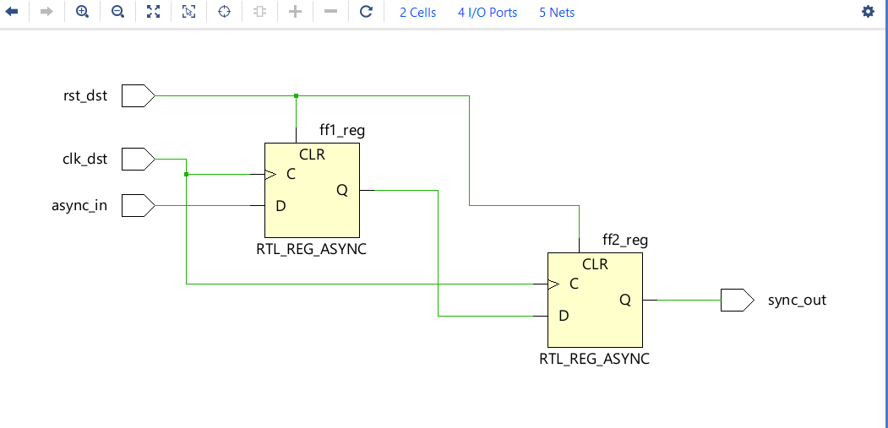
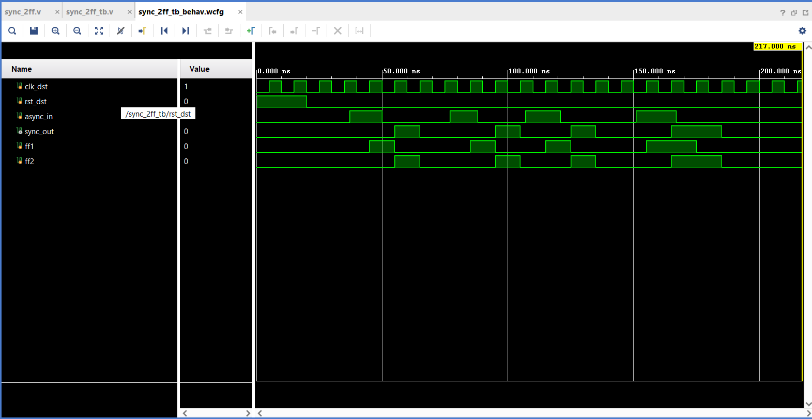

# CDC 2FF Synchronizer

## Overview
This project implements a Clock Domain Crossing (CDC) Two-Flip-Flop (2FF) Synchronizer in Verilog. The design safely transfers a single-bit signal from one clock domain to another while reducing the probability of metastability.

## Features
- Two Flip-Flop Synchronizer
- Verilog HDL Implementation
- Functional Simulation using Vivado
- RTL Schematic
- Waveform Verification
- Easy to understand and reusable design

## Project Structure

```
CDC-2FF-Synchronizer
│
├── rtl/
│   └── sync_2ff.v
├── tb/
│   └── sync_2ff_tb.v
├── schematics/
│   └── 2ff_rtl.png
├── waveforms/
│   └── 2ff_waveform.png
└── README.md
```

## Tools Used

- Verilog HDL
- Xilinx Vivado 2025.2

## Simulation Result

The simulation confirms that the input signal is synchronized to the destination clock after passing through two flip-flops.

## RTL Schematic



## Waveform



## Applications

- Clock Domain Crossing (CDC)
- FPGA Designs
- ASIC Designs
- Digital VLSI Systems

## Author

Snehanjali Dasari
